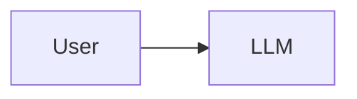
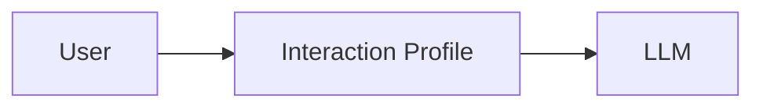
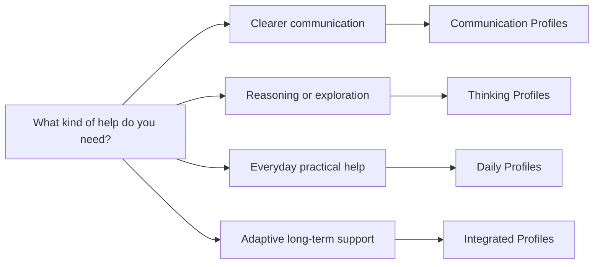
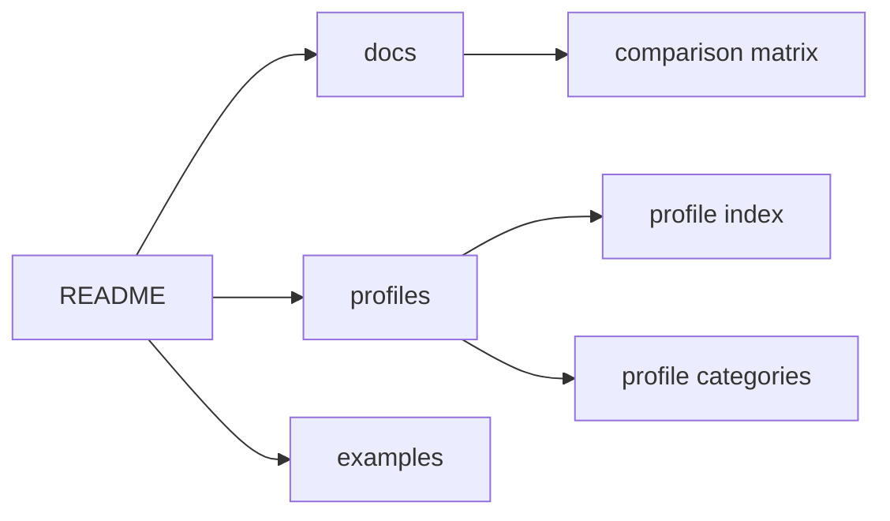

# AI Interaction Profiles

> A reusable interaction layer for making existing AI assistants clearer, calmer, and more helpful over time.

[](#roadmap-summary)
[](LICENSE)
[](profiles/index.md)

AI Interaction Profiles is a research-inspired library of reusable behavior profiles for existing AI assistants. Instead of replacing ChatGPT, Claude, Gemini, or other tools, it explores how the interaction itself can be designed more carefully.

The core idea is simple:

**Better AI conversations are not only about stronger models. They are also about better interaction patterns.**

Use this repository to browse profiles, compare interaction styles, and copy a Full or Concise Version into an assistant's personalization or custom-instruction settings.

## Start Here

- [Browse all profiles](profiles/index.md)
- [Compare profiles](docs/comparison-matrix.md)
- [Read the philosophy](docs/philosophy.md)
- [See before-and-after examples](examples/before-after.md)

## Why This Exists

Most AI products focus on stronger models, larger context windows, more tools, or new interfaces. Those improvements matter, but many everyday AI frustrations come from the shape of the conversation:

- too many clarifying questions before any help appears;
- vague requests that receive confident but misaligned answers;
- brainstorms that become overwhelming lists;
- rewrites that erase the user's voice;
- planning conversations that add structure without reducing pressure;
- repeated instructions such as "keep it concise" or "challenge my assumptions."

Interaction Profiles address those recurring behaviors directly. The model can stay the same. The user's preferred tool can stay the same. The interaction can become more intentional.

## How It Works

Most AI conversations look like this:



This repository explores a slightly richer pattern:



An Interaction Profile is a written behavior guide that describes how an assistant should collaborate across conversations. It can guide choices such as when to ask for clarification, when to infer and proceed, when to challenge assumptions, how to preserve the user's voice, and how to respect urgency.

## Choose A Profile



| Category | Use When You Need | Start With |
| --- | --- | --- |
| Communication | Clearer writing, better questions, English improvement, or structured expression | [Better Questions](profiles/communication/better-questions/profile.md) |
| Daily | Practical everyday help for learning, planning, decisions, or workflow | [Learning Companion](profiles/daily/learning-companion/profile.md) |
| Thinking | Brainstorming, critical thinking, research, or Socratic learning | [Critical Thinker](profiles/thinking/critical-thinker/profile.md) |
| Integrated | Broader adaptive support or deeper reflection | [Adaptive Guidance](profiles/integrated/adaptive-guidance/profile.md) |

For a complete selection table, see the [Profile Index](profiles/index.md) and [Comparison Matrix](docs/comparison-matrix.md).

## Repository Map



## What This Repository Is

This repository is:

- a library of Interaction Profiles;
- a documentation-first proof-of-concept;
- a design vocabulary for human-AI interaction behavior;
- a set of examples and principles for evaluating interaction quality.

It is not:

- a chatbot;
- a model wrapper;
- a browser extension;
- an API;
- a claim of scientific validation.

## Profile Versions

Each profile page includes two copyable versions:

- **Full Version:** recommended whenever your AI platform supports longer persistent instructions.
- **Concise Version:** optimized for platforms with approximately 1500-character instruction limits, such as ChatGPT Personalization or Gemini Personalization.

The concise version is not a summary. It is a compressed edition of the same interaction behavior.

## Repository Structure

```text
.
├── README.md
├── docs/
│   ├── comparison-matrix.md
│   ├── manifesto.md
│   ├── philosophy.md
│   ├── problem.md
│   ├── vision.md
│   ├── faq.md
│   ├── getting-started.md
│   ├── writing-good-profiles.md
│   └── design-principles.md
├── examples/
│   ├── before-after.md
│   └── comparison-gallery.md
├── profiles/
│   ├── index.md
│   ├── communication/
│   ├── daily/
│   ├── thinking/
│   └── integrated/
├── assets/
└── .github/
```

## Current Limitations

This repository does not claim that Interaction Profiles work equally well for every user, model, task, or context. Profiles can guide behavior, but they do not improve model intelligence or guarantee factual accuracy.

Use AI outputs carefully, especially for health, law, finance, employment, safety, or other high-stakes decisions.

## Roadmap Summary

- **Version 0.1:** Initial repository foundation.
- **Version 0.2:** Documentation revision, terminology, profile taxonomy, and examples.
- **Version 1.0:** Consolidated profile pages, navigation, comparison matrix, and copy-ready Interaction Profiles.
- **Future:** Evaluation methods, user feedback, and possible adaptive interaction research.

See the full [Roadmap](ROADMAP.md).

## Contributing

Contributions are welcome when they improve clarity, examples, profile quality, evaluation criteria, or documentation consistency.

Please read:

- [Contributing Guide](CONTRIBUTING.md)
- [Code of Conduct](CODE_OF_CONDUCT.md)
- [Writing Good Profiles](docs/writing-good-profiles.md)

## License

This project is licensed under the [MIT License](LICENSE).

## Acknowledgements

This project builds on public work and discussion across human-AI interaction, conversational design, tutoring systems, writing support, reflective practice, and user agency. It focuses on one testable idea: conversation behavior itself is a design material.
