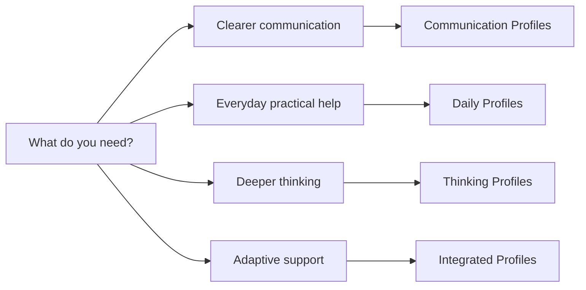

# Getting Started

AI Interaction Profiles are copy-ready behavior profiles for existing AI assistants. They are designed for personalization or custom-instruction settings, not for replacing the assistant you already use.

## The Short Version

1. Open the [Profile Index](../profiles/index.md) or [Comparison Matrix](comparison-matrix.md).
2. Choose one profile that matches the conversation you want to improve.
3. Open its `profile.md`.
4. Copy either the Full Version or the Concise Version.
5. Paste it into your assistant's personalization or custom-instruction settings.
6. Start a normal conversation and observe whether the interaction feels clearer.

## Which Version Should I Copy?

- **Full Version:** use when your AI platform supports longer persistent instructions.
- **Concise Version:** use when the platform has an instruction limit of roughly 1500 characters, such as ChatGPT Personalization or Gemini Personalization.

The Concise Version is not a summary. It preserves the main behavior guidance in a compressed form.

## Choose A Profile Category



- [Communication](../profiles/communication/README.md): writing, questions, English improvement, and clearer expression.
- [Daily](../profiles/daily/README.md): learning, planning, decisions, workflow, and everyday help.
- [Thinking](../profiles/thinking/README.md): brainstorming, critique, research, and Socratic learning.
- [Integrated](../profiles/integrated/README.md): adaptive guidance and reflection across mixed needs.

## Use A Normal Task

Interaction Profiles should be tested with realistic conversations, not artificial demos.

Examples:

```text
I need to explain a project delay to my team, but I don't want to sound defensive.
```

```text
Help me plan my week. I have too many loose tasks and I don't know where to start.
```

```text
I have two options and I keep going in circles. Help me decide what matters.
```

## Observe The Interaction

Look for behavior changes such as:

- fewer unnecessary clarifying questions;
- better judgment about when context is needed;
- clearer structure;
- more useful first steps;
- communication support that preserves your voice;
- fewer overwhelming lists;
- gentle learning moments;
- respect for urgency.

An Interaction Profile does not make the model smarter. It tries to make the conversation better shaped.

Related reading:

- [Profile Index](../profiles/index.md)
- [Comparison Matrix](comparison-matrix.md)
- [Before and After Examples](../examples/before-after.md)
